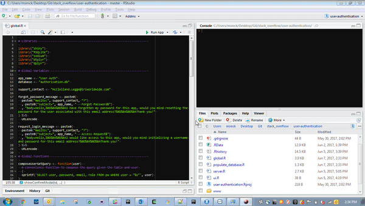

# R Shiny User Authentication 

First you'll need to clone this repo:

```bash
# if you're on your client
git clone http://csmrnd01.infores.com:3000/CSM-RND/shiny-user-authentication.git

# if you're on a server
git@csmrnd01.infores.com:CSM-RND/shiny-user-authentication.git
```

Then load it as a project in RStudio, install the needed packages and click "Run App"


